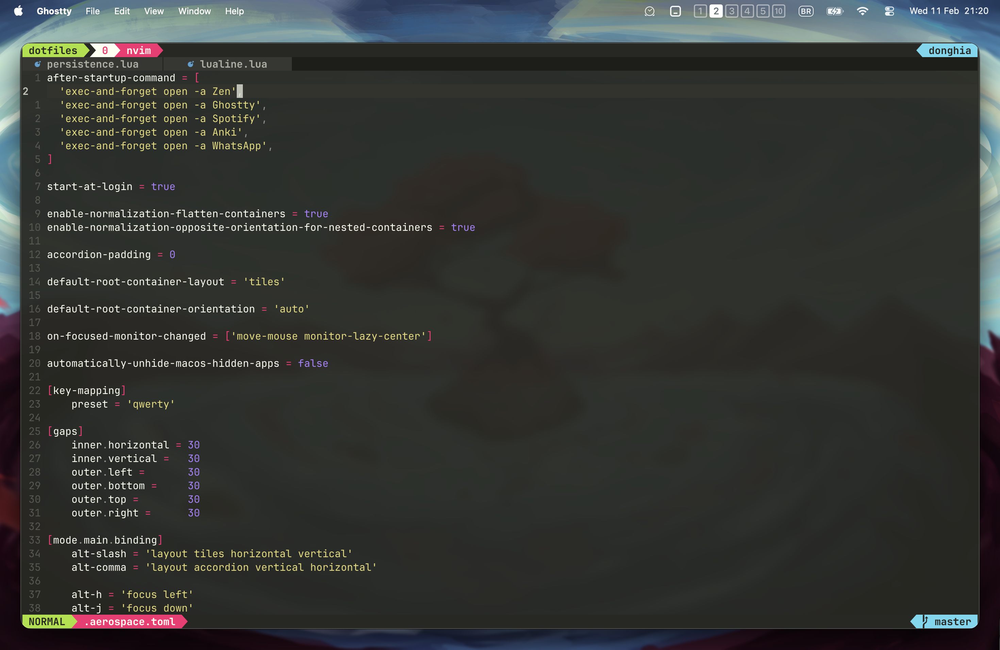
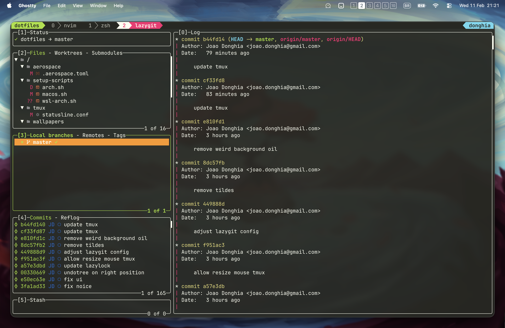
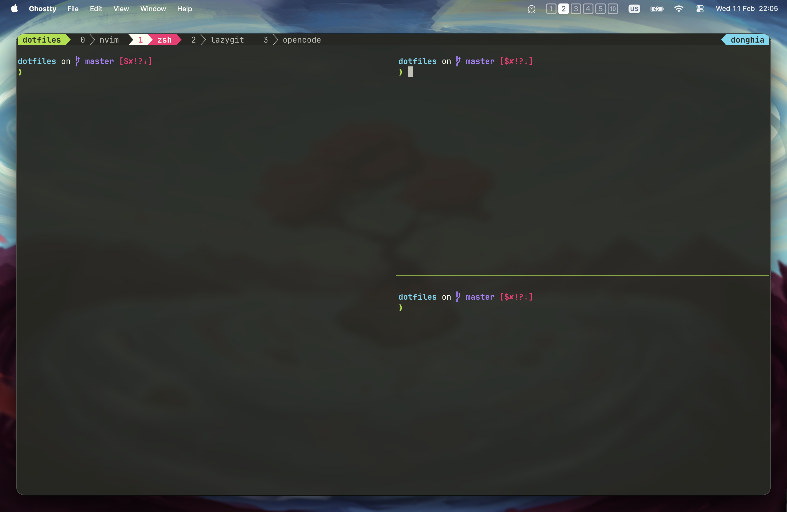

|              Lazygit               |              Ghostty               |
| :--------------------------------: | :--------------------------------: |
|  |  |

## Overview

Dotfiles to save time setting up new environments.

### Workflow

- **Operational System**: MacOS
- **Window Manager**: Aerospace + Raycast
- **IDE**: Neovim
- **Terminal**: Ghostty
- **Shell**: zsh
- **Session manager**: Tmux
- **Git Tool**: Lazygit

#### Neovim Core Plugins

- **Markdown**: render-markdown, markdown-preview, obsidian
- **File Search**: telescope, oil, harpoon 

#### Keyboards

- **Corne:** Main Keyboard, uses ZMK Firmware. you can check out my config <https://github.com/jdonghia/zmk-config>, which is also a module on this repo.
- **Silakka54:** Old Keyboard, uses Vial Firmware.

## Other Operational Systems

### Windows Setup (Arch WSL)

- **Window Manager**: GlazeWM & Yasb + Power Toys Run
- **Terminal**: Windows Terminal

### Linux (Arch)

- **Window Manager**: Hyprland + Waybar

